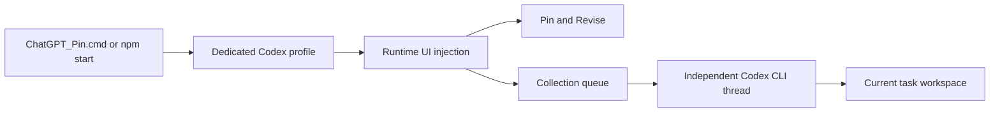

# Chat Pin for Codex Desktop

> Turn Codex answers into living Markdown documents.

[](https://github.com/Ace199/codex-chat-pin)
[](#platform-status)
[](#platform-status)
[](LICENSE)

Chat Pin is a local, unofficial enhancement for Codex Desktop. Pin a useful
assistant response as a real Markdown file, revise that file in place, or use
any Markdown document as a repeatable workflow for isolated Codex CLI tasks.

It does **not** modify the Codex installation package or read your chat
database, cookies, or account tokens.

## Why Chat Pin?

Codex is excellent at generating content, but an important answer can easily
disappear inside a long conversation. Copying it into another editor breaks the
workflow, while asking for a revision often produces another full copy.

Chat Pin gives the conversation one persistent working document:

- **Pin** — preserve a complete answer as Markdown and open it in Codex's
  native file viewer.
- **Revise** — describe only the change you want; Codex edits the actual file
  while preserving unrelated sections and code blocks.
- **Collect** — treat any Markdown file as an executable workflow and process
  repeated inputs in fresh, isolated Codex CLI threads.
- **Local first** — Pins, queues, snapshots, and execution reports stay on
  your machine.

## Three workflows

### 1. Turn an answer into a working document

Click the Pin icon below a final Codex response. Chat Pin converts the rendered
answer to Markdown, saves it, opens the native right sidebar, and selects the
new file.

Headings, lists, links, tables, blockquotes, emphasis, images, and fenced code
blocks are preserved where the current Codex renderer exposes enough semantic
structure. Code-toolbar labels such as `Plain text` and `Copy code` are removed.

### 2. Revise without regenerating everything

Open the active Pin and enable **Revise** next to **View Source**. Then write
only the requested change:

```text
Make the “Why this approach” section more detailed.
```

Chat Pin adds the file-editing constraint at send time without placing hidden
instructions in the visible composer. It saves a local pre-edit snapshot and
checks the file hash after the turn, so a normal text answer is not mistaken
for a successful revision.

### 3. Run repeated inputs through one Markdown workflow

Open any Markdown file and enable **Collect**. Each submitted input is removed
from the normal Desktop send path and added to a local FIFO queue. A separate
Codex CLI App Server creates a fresh thread for every item, using:

- the selected Markdown file as the processing rules;
- the current input as the material to process;
- the active task workspace as the working directory;
- the model and reasoning effort selected in Codex Desktop when recognizable.

Collection mode is useful for research archives, GitHub project libraries,
investment notes, article intake, structured knowledge bases, and repeated
project maintenance. The rule file can require actual source records, index
updates, link verification, or other workspace changes—the CLI must execute
those steps rather than merely propose them.

## Quick start

### Requirements

- Codex Desktop
- [Node.js](https://nodejs.org/) 22.5 or newer
- Windows 10/11 for the currently tested path
- A separately installed [Codex CLI](https://developers.openai.com/codex/cli/)
  only if you want to use Collection mode

### Install and run

```powershell
git clone https://github.com/Ace199/codex-chat-pin.git
cd codex-chat-pin
npm start
```

On Windows, you can instead double-click `ChatGPT_Pin.cmd` after cloning the
repository.

Keep the launcher terminal open while using the dedicated Chat Pin window.
Closing it stops the Codex instance managed by Chat Pin. The first launch uses
an isolated local profile and may require signing in to Codex again.

### Verify the checkout

```powershell
npm run check
```

This runs syntax checks and the current unit/protocol test suite.

## What happens when you start it?



The launcher starts an isolated Codex Desktop instance and injects the UI at
runtime through the Chrome DevTools Protocol. It does not patch `app.asar`,
replace signed application files, or modify the Codex updater.

On Windows, the launcher resolves the Microsoft Store desktop executable. If
Windows blocks direct process creation with `spawn EPERM`, Chat Pin falls back
to the registered application identity and a random loopback CDP port. The
bundled `resources/codex.exe` is a CLI binary and is never treated as the
desktop application.

## Platform status

| Capability | Status |
| --- | --- |
| Pin a final assistant response | Available |
| Preserve common Markdown structures | Available; custom renderers may fall back to text |
| Open a Pin in the native file sidebar | Available; depends on the current Codex UI |
| Conversation-isolated Pin files | Available; one active Pin per task |
| Cross-workspace Pin mirror | Available |
| Revision mode with snapshots and file-hash verification | Available |
| Collection from Pin or ordinary Markdown files | Beta |
| Isolated CLI thread per Collection item | Beta |
| Retry, interrupt, queue clearing, progress, and local reports | Beta |
| Windows desktop launch and injection | Tested manually on multiple Windows environments |
| macOS desktop launch and injection | Experimental; path resolution is tested, full workflow is not |

## Collection behavior

Collection and Revision modes are mutually exclusive. While Collection mode is
active, the green status bar identifies the current rule file, queue state,
elapsed time, failures, and completed reports. The launcher terminal prints
bounded progress and a heartbeat without printing the full user input or model
output.

Each item uses a single-concurrency queue and a new App Server thread. It does
not inherit the Desktop conversation or previous Collection items, although
normal Codex system rules, account configuration, managed policies, and the
workspace's `AGENTS.md` still apply.

The CLI runs with a non-interactive approval policy and a `workspaceWrite`
sandbox restricted to the active task workspace. Collection rules can therefore
modify files inside that workspace. Clearing an active item requests an
interrupt, but changes already written before cancellation are not rolled back.

For the detailed state model and implementation boundaries, see
[`docs/COLLECTION_MODE_DESIGN.md`](docs/COLLECTION_MODE_DESIGN.md).

## Model selection and advanced configuration

Collection snapshots the model label beside the Desktop composer. When the
label is recognized, the same model and reasoning effort are sent to the
independent CLI. Explicit environment variables override that snapshot; an
automatic routine/complex profile is used only when the UI label cannot be
recognized.

```powershell
$env:CODEX_PIN_CLI_PATH = "C:\path\to\codex.cmd"
$env:CODEX_PIN_COLLECTION_PROFILE = "routine" # routine, complex, or inherit
$env:CODEX_PIN_COLLECTION_MODEL = "gpt-5.6-terra"
$env:CODEX_PIN_COLLECTION_EFFORT = "medium"
$env:CODEX_PIN_COLLECTION_COMPACT_TOKENS = "100000" # 0 disables the override
$env:CODEX_PIN_COLLECTION_COMPACT_SCOPE = "body_after_prefix" # or total
npm start
```

To use a non-default Codex Desktop installation:

```powershell
node scripts/pin-launcher.mjs --launch --watch --app-path "C:\path\to\ChatGPT.exe"
```

```bash
node scripts/pin-launcher.mjs --launch --watch --app-path "/custom/Codex.app"
```

The same path can be set with `CODEX_PIN_APP_PATH`. For test profiles or
multiple isolated instances, set `CODEX_PIN_PROFILE` to a different directory.

## Local files and privacy

| Data | Default location |
| --- | --- |
| Primary Pins | `pins/pin_<task-id>.md` |
| Workspace-visible Pin mirror | `<task-workspace>/pins/pin_<task-id>.md` |
| Isolated Codex profile | `.codex-pin-profile/` |
| Collection queues and reports | `.codex-pin-profile/collection-queue/` |
| Revision snapshots | `.codex-pin-profile/revision-history/` |

Runtime data is excluded from this repository. In Git workspaces, Chat Pin also
uses local `.git/info/exclude` rules for generated Pin mirrors instead of
modifying the project's `.gitignore`. Non-Git workspaces have no equivalent
local exclusion mechanism, so their mirror remains a normal file.

Chat Pin does not upload Pin content itself. Codex Desktop and Codex CLI still
communicate with their configured OpenAI services in the normal way.

## Current limitations

- This is an unofficial runtime integration, not an OpenAI Plugin or supported
  Codex extension API.
- Codex UI updates can change selectors, menus, file filters, or send controls;
  native opening and injection should be revalidated after major updates.
- Only one active Pin is supported per Codex task.
- Manual edits made while Revision mode is disabled are not automatically
  synchronized from a workspace mirror to the primary Pin.
- Revision mode cannot force Codex to edit a file or bypass a permission prompt;
  it reports when no file change occurred.
- Collection is intentionally single-concurrency to avoid simultaneous edits to
  the same indexes or source files.
- Collection execution can take minutes for research-heavy rules. The status bar
  and launcher heartbeat show progress, but they do not make the model turn
  instantaneous.
- GitHub preflight checks are unauthenticated and cannot distinguish a private
  repository from a missing repository.
- Tool-output limits after deterministic preflight are model instructions, not a
  hard App Server byte cap.
- macOS has not yet received a full native launch, injection, save, revision, and
  Collection end-to-end verification pass.

## Troubleshooting

### Collection cannot find Codex CLI

Run both commands in a terminal:

```powershell
codex --version
codex app-server --help
```

If Codex CLI is installed outside `PATH`, set `CODEX_PIN_CLI_PATH`. Chat Pin does
not use the CLI bundled inside the Microsoft Store desktop package as an
independent executable.

### The injected UI updated but an action is unavailable

Close the dedicated Chat Pin Codex window and its launcher terminal, then start
`ChatGPT_Pin.cmd` again. Script hot reload cannot add new launcher protocol
capabilities to an already running background process.

### Native file opening fails after a Codex update

The Markdown file is still saved even when the native sidebar automation fails.
Open it from the current task's workspace tree and include the displayed error
when filing an issue.

## Roadmap

- DOM fixtures for response-to-Markdown conversion
- A repeatable native-sidebar state matrix
- More actionable Collection performance metrics
- Simpler packaged installation and updates
- Full macOS end-to-end validation
- Multiple active working documents and revision history UI

## Contributing

Bug reports and focused pull requests are welcome. When reporting a UI issue,
please include:

- operating system and Codex Desktop version;
- whether the right sidebar was closed, empty, or already showing a file;
- the exact Chat Pin error message;
- the shortest reproducible sequence;
- a screenshot with private content removed.

Please do not include cookies, access tokens, account data, or private
conversation contents in an issue.

## License

[MIT](LICENSE) © 2026 Ace199

## Disclaimer

Chat Pin is an independent, unofficial project and is not affiliated with or
endorsed by OpenAI. “Codex” and related product names belong to their respective
owners.
